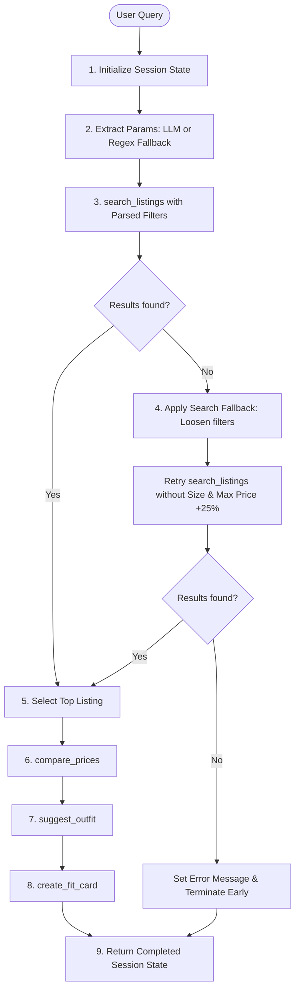

# FitFindr 🛍️✨

FitFindr is an AI-powered personal shopping assistant and outfit stylist. It helps users discover secondhand fashion listings, suggests stylish outfit pairings from their existing wardrobe (or provides general recommendations), compares prices against marketplace averages, and generates catchy, trend-aligned social media captions (fit cards).

The project is built around an orchestrator agent that parses natural language queries, manages a central state, runs a conditional planning loop, and hooks into a responsive Gradio web UI.

---

## 🚀 Setup & Execution

### 1. Install Dependencies
Ensure you have Python 3.10+ installed. Install the project requirements:
```bash
pip install -r requirements.txt
```

### 2. Configure Environment Variables
Create a `.env` file in the root directory and add your Groq API Key:
```env
GROQ_API_KEY=your_groq_api_key_here
```

### 3. Run the Application
Start the Gradio interface:
```bash
python app.py
```
After launching, open the URL displayed in the terminal (usually `http://127.0.0.1:7860`).

---

## 🛠️ Tool Inventory

The agent orchestrates four primary tools in [tools.py](file:///c:/Users/thai0/OneDrive/Documents/Codepath/AI201/ai201-project2-fitfindr-starter/tools.py). Below is the precise API inventory matching the function signatures:

### 1. `search_listings`
* **Inputs**:
  * `description` (`str`): Keywords describing the item being searched (e.g., `"vintage graphic tee"`).
  * `size` (`str | None`, default: `None`): Optional size filter. Matching handles common size abbreviations (e.g., `"M"` matches `"Medium"`, `"S/M"`).
  * `max_price` (`float | None`, default: `None`): Optional price ceiling.
* **Outputs**: `list[dict]`
  * A list of matching listing dictionaries from the database, sorted descending by a calculated keyword relevance score. Returns an empty list `[]` if no matches exist.
* **Purpose**: Performs a structured search and scores mock clothing listings based on title, style tags, and description keyword overlaps.

### 2. `suggest_outfit`
* **Inputs**:
  * `new_item` (`dict`): The target listing dictionary being considered for purchase.
  * `wardrobe` (`dict`): The user's wardrobe dictionary containing a list of item dictionaries under the `"items"` key.
* **Outputs**: `dict`
  * A dictionary with two keys:
    * `"items"` (`list[dict]`): A list of dictionaries representing the selected wardrobe items plus the `new_item`.
    * `"description"` (`str`): Detailed outfit combinations, styling advice, and overall vibe notes.
* **Purpose**: Acts as an AI fashion stylist to recommend 1–2 complete outfit combinations using the user's wardrobe.

### 3. `create_fit_card`
* **Inputs**:
  * `outfit` (`dict | str`): The output dictionary (or styling description string) from `suggest_outfit`.
  * `new_item` (`dict`): The target listing dictionary.
* **Outputs**: `str`
  * A short (2–4 sentences), casual, authentic social media caption (Instagram/TikTok style) containing emojis, minor slang, and required metadata.
* **Purpose**: Automatically generates a trendy social media caption to showcase the outfit suggestion.

### 4. `compare_prices` (Stretch Goal)
* **Inputs**:
  * `new_item` (`dict`): The selected listing dictionary.
  * `listings` (`list[dict]`): The entire listings database to compare against.
* **Outputs**: `dict | None`
  * A dictionary containing comparison statistics:
    * `"average_price"` (`float`): The average price of comparable listings.
    * `"difference_percent"` (`float`): Percentage difference (negative if the new item is cheaper).
    * `"deal_rating"` (`str`): `"Good Deal"`, `"Fair Price"`, or `"Overpriced"`.
  * Returns `None` if no comparable listings are found.
* **Purpose**: Compares the price of the selected listing against items in the same category and style tags to determine if it is a good deal.

---

## 🔄 The Planning Loop

The agent's decision-making flow is orchestrated in `run_agent()` within [agent.py](file:///c:/Users/thai0/OneDrive/Documents/Codepath/AI201/ai201-project2-fitfindr-starter/agent.py). It uses conditional logic to navigate successful and failing paths:



### Decision Logic Breakdown:
1. **Query Parsing**: The agent uses Llama-3.3 via Groq to extract structured fields (`description`, `size`, `max_price`) from raw text. If the Groq client fails (e.g., API key missing, network timeout), the agent catches the exception and falls back to a deterministic, regex-based fallback query parser (`_fallback_query_parser`).
2. **Conditional Search Retry**:
   * If the primary search yields matches, it continues directly to selection.
   * If the primary search yields 0 matches, the planning loop intercepts the empty list. It relaxes search criteria: it drops the `size` filter entirely and boosts the `max_price` ceiling by 25%. It saves a fallback warning to `session["fallback_adjusted"]` and retries.
   * If the retry also yields 0 matches, the agent sets a friendly suggestion in `session["error"]` and **exits early**, preventing subsequent API calls (which would fail due to a missing target item).
3. **Downstream Pipeline Execution**: If a listing is successfully found, the agent proceeds to compare prices, generate styling advice, and create the social media caption, storing each tool's result in the session.

---

## 🗄️ State Management

FitFindr uses a **single source of truth** approach by maintaining a mutable session dictionary (`session`) across the lifetime of a single query execution. The session state is initialized using `_new_session(query, wardrobe)` with the following schema:

| Key | Type | Description | When Populated / Updated |
|---|---|---|---|
| `query` | `str` | Raw string query typed by the user | Initialization |
| `parsed` | `dict` | Extracted `description`, `size`, and `max_price` | Post Query Parsing |
| `search_results` | `list[dict]` | All listings matching query filters | Post Search |
| `selected_item` | `dict \| None` | First (highest-scoring) matching listing | Post Search (if successful) |
| `price_comparison` | `dict \| None` | Deal rating statistics from `compare_prices` | Post Search |
| `wardrobe` | `dict` | The user's active wardrobe items | Initialization |
| `outfit_suggestion`| `dict \| None` | Outfit pairing details & stylist description | Post Stylist Suggestion |
| `fit_card` | `str \| None` | OOTD social media caption | Post Fit Card Generation |
| `fallback_adjusted`| `str \| None` | Warning string indicating search adjustments | Post Fallback Search Retry |
| `error` | `str \| None` | Early termination error details | Any step where failure occurs |

### State Passing Example:
* `search_listings` outputs a list of matches. The agent stores the first match into `session["selected_item"]`.
* `suggest_outfit` takes `session["selected_item"]` and `session["wardrobe"]` as parameters.
* `create_fit_card` takes the resulting `session["outfit_suggestion"]` and `session["selected_item"]` to generate the social media caption.
* Finally, the Gradio dashboard parses the filled `session` dict to populate the layout panels.

---

## 🛡️ Error Handling Strategy

| Tool / Step | Anticipated Failure Mode | Defensive/Graceful Agent Response |
|---|---|---|
| **Query Parser** | Groq API failure or missing API key | Catches exception, logs warning, and delegates query parsing to a local regex parser (`_fallback_query_parser`). |
| **`search_listings`** | No items match query description, size, or price | Automatically relaxes query parameters (drops size filter, raises max price limit by 25%). If still no matches are found, it sets a clear error message in `session["error"]` and stops early. |
| **`suggest_outfit`** | User wardrobe is empty | The tool catches the empty list, alters the LLM prompt to request general styling and color-palette advice, and returns a valid dictionary with `"items"` containing only the new item. |
| **`suggest_outfit`** | LLM output is malformed or Groq API fails | Catches JSON/API errors and returns a fallback recommendation dict featuring basic clothing pieces (e.g. styling with denim and neutral shoes) to avoid breaking the app. |
| **`create_fit_card`** | Missing outfit inputs or empty description | Returns an error message string (`"Error: Could not generate a fit card due to missing styling information"`) instead of raising an exception. |
| **`create_fit_card`** | Groq API failure | Catches API errors and returns a generic, pre-formatted caption containing the item title, price, and platform: `"obsessed with my new {title} from {platform} for ${price}! styling it with some neutral basics today 🖤"`. |
| **`compare_prices`** | No similar listings found in the dataset | Safely returns `None`, which the UI checks and formats as `"💰 Deal Rating: No comparable items found to rate price."` instead of crashing. |

### Concrete Test Example: Early Termination on Empty Search
* **Input Query**: `"designer ballgown size XXS under $5"`
* **Expected Result**: No matching items in the database.
* **Testing Behavior**: The primary search for `"designer ballgown"` with size `"XXS"` and max price `5.0` returned `[]`. The planning loop dropped the size filter and set the max price to `6.25`, and ran the search again. The search still returned `[]`.
* **Graceful Response**: The agent halted execution, set `session["error"]` to `"No listings found matching 'designer ballgown' even after broadening search parameters. Try using different keywords."`, and terminated. The Gradio interface displayed this error message in the first output panel, while leaving the other panels empty rather than crashing.

---

## 💭 Spec Reflection

### How the Spec & Diagram Helped
Writing the `planning.md` schema and the Mermaid flowchart before implementing the python files proved invaluable. It clearly defined the boundaries of each tool: for instance, it clarified that `search_listings` is purely algorithmic (regex and keyword matching) whereas `suggest_outfit` and `create_fit_card` are LLM-based. Establishing the fields of the `session` dictionary early made writing the orchestration loop in `agent.py` a plug-and-play process, preventing bugs related to mismatched dictionary keys.

### Where the Implementation Diverged
The implementation diverged from the spec in `suggest_outfit`'s return type. Initially, I planned for `suggest_outfit` to return an `outfits` dictionary containing multiple complete outfit options. However, during the implementation phase, I realized that returning a single structured dictionary with keys `"items"` (combining the selected wardrobe items and the new item) and `"description"` (containing 1–2 detailed combination ideas) was much cleaner. This unified structure allowed the LLM to output highly reliable JSON, made it simpler to pass state into `create_fit_card`, and was significantly easier to display in the Gradio textboxes.

---

## 🤖 AI Usage Section

### Instance 1: Search Relevance Scoring Logic
* **Input Given**: I fed the AI code generator the specifications for `search_listings` including the rules that listings should be scored and sorted based on matching keywords in their title (weight 3), style tags (weight 2), and description (weight 1).
* **AI Output**: The AI generated code that used a strict, exact-string match for the query description (e.g., `item.title.lower() == description.lower()`).
* **Override/Revision**: I overrode this behavior by splitting the query description into individual alphanumeric word tokens using `re.findall(r"\w+", description.lower())`. This enabled fuzzy keyword matching where a query like "vintage graphic tee" correctly scores points if "vintage" is in the style tags and "tee" is in the title, and sorts results by cumulative score.

### Instance 2: LLM Query Parsing Fallback
* **Input Given**: I asked the AI to design the `_parse_query_with_llm` function using Groq's chat completion API to output JSON structured with `description`, `size`, and `max_price`.
* **AI Output**: The AI generated code that raised exceptions if `GROQ_API_KEY` was missing or if the API call failed, which would crash the entire agent loop.
* **Override/Revision**: I added a try-except block wrapping the Groq API initialization and call. I then implemented a fully local regex-based query parser (`_fallback_query_parser`) as the exception handler. This guarantees that if the key is missing or the client is offline, the agent downgrades gracefully and still extracts basic filters, ensuring high system reliability.

