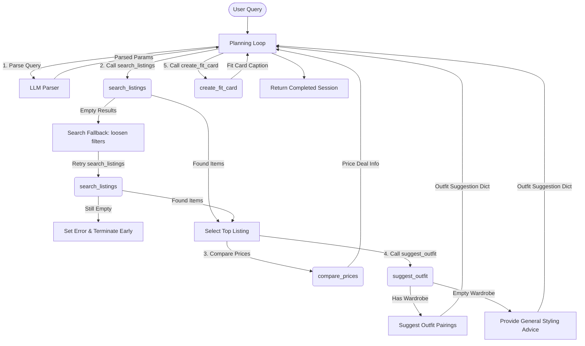

# FitFindr — planning.md

> Complete this document before writing any implementation code.
> Your spec and agent diagram are what you'll use to direct AI tools (Claude, Copilot, etc.) to generate your implementation — the more specific they are, the more useful the generated code will be.
> Your planning.md will be reviewed as part of your submission.
> Update it before starting any stretch features.

---

## Tools

List every tool your agent will use. For each tool, fill in all four fields.
You must have at least 3 tools. The three required tools are listed — add any additional tools below them.

### Tool 1: search_listings

**What it does:**
<!-- Describe what this tool does in 1–2 sentences -->
Search mock listings dataset to find items matching the users query description, size, and max price. Sorted by keyword relevance.

**Input parameters:**
<!-- List each parameter, its type, and what it represents -->
- `description` (str): Search term keywords
- `size` (str): The size of the item the user is looking for. Matches are case-insensitive and allow partial overlaps (e.g., 'M' matches 'S/M', 'Medium', 'Mediums').
- `max_price` (float): The maximum price the user is willing to pay for the item.

**What it returns:**
<!-- Describe the return value — what fields does a result contain? -->
- `listings` (list): A list of dictionaries representing clothing items. Each dictionary contains: `title` (str), `platform` (str), `price` (float), `category` (str), `description` (str), `colors` (list[str]). Sorted by keyword matching relevance score.

**What happens if it fails or returns nothing:**
<!-- What should the agent do if no listings match? -->
Returns an empty list. The planning loop will intercept this empty list, store a helpful error in the session state explaining what filters failed, and exit early without proceeding to the next steps.
---

### Tool 2: suggest_outfit

**What it does:**
<!-- Describe what this tool does in 1–2 sentences -->
Suggests 1-2 complete outfits combinations using the new item + the user's wardrobe.

**Input parameters:**
<!-- List each parameter, its type, and what it represents -->
- `new_item` (dict): The item the user just added to their wardrobe. It has the same schema as items in the wardrobe.
- `wardrobe` (dict): The user's current wardrobe, containing a "items" list of wardrobe item dicts.

**What it returns:** `outfits` (dict) containing:
<!-- Describe the return value -->
- `items` (list[dict]): The list of specific wardrobe item dictionaries selected from the user's wardrobe + the new item
- `description` (str): detailed outfit suggestions and styling tips
**What happens if it fails or returns nothing:**
<!-- What should the agent do if the wardrobe is empty or no outfit can be suggested? -->
If the wardrobe is empty or has no items, the tool will format a fallback prompt to the LLM to get general styling advice (vibe, colors, fit recommendations) rather than failing, returning `{"items": [], "description": "<styling advice>"}`.
---

### Tool 3: create_fit_card

**What it does:**
<!-- Describe what this tool does in 1–2 sentences -->
Generate a short, casual, and authentic OOTD caption (Instagram style) showcasing the selected listing item and styling suggestion.

**Input parameters:**
<!-- List each parameter, its type, and what it represents -->
- `outfit` (dict): A dictionary containing the outfit suggestion and styling tips from the suggest_outfit tool.
- `new_item` (dict): the selected listing dictionary

**What it returns:**
<!-- Describe the return value -->
- `caption` (str): A 2-4 sentence short, casual, and authentic OOTD caption (Instagram style).

**What happens if it fails or returns nothing:**
<!-- What should the agent do if the outfit data is incomplete? -->
If the outfit dict is empty/invalid, it returns a descriptive error message string(e.g., "Error: Could not generate a fit card due to missing styling information") instead of throwing an exception.

---

### Additional Tools (if any)

<!-- Copy the block above for any tools beyond the required three -->
### Tool 4: compare_prices

**What it does:**
<!-- Describe what this tool does in 1–2 sentences -->
Compares the price of the selected item with the average price of comparable listings in the database (matching the same category and/or style tags).

**Input parameters:**
<!-- List each parameter, its type, and what it represents -->
- `new_item` (dict): The selected listing dictionary.
- `listings` (list[dict]): The full list of listings to compare against.

**What it returns:** dict containing:
<!-- Describe the return value -->
- `average_price` (float): The average price of comparable items.
- `difference_percent` (float): Percent difference (negative if the item is a deal).
- `deal_rating` (str): "Good Deal", "Fair Price", or "Overpriced".

**What happens if it fails or returns nothing:**
<!-- What should the agent do if there are no comparable listings to compare against? -->
Returns `None`.

---

## Planning Loop

**How does your agent decide which tool to call next?**
The planning loop is orchestrated by `run_agent()` and follows a strict conditional execution path:
1. **Initialization**: Initialize the session state dictionary using `_new_session(query, wardrobe)`.
2. **Query Parsing**: Use an LLM call to Groq to extract `description` (str), `size` (str or None), and `max_price` (float or None) from the raw user query. Store this structured data in `session["parsed"]`.
3. **Primary Search**: Call `search_listings(description, size, max_price)`.
4. **Search Fallback Check**:
   * If search results are returned: Proceed directly to Step 5.
   * If search results are empty: 
     * Broaden the search constraints (remove the `size` filter and increase `max_price` by 25%).
     * Set a descriptive message in `session["fallback_adjusted"]` notifying the user of the adjustments.
     * Call `search_listings` again with the widened parameters.
     * If the fallback search also returns no results: Set `session["error"]` to a friendly message (e.g., advising the user to try different keywords) and **terminate the agent early**, returning the session state.
5. **Selection**: Store the full list of search results in `session["search_results"]`. Select the first (top-ranked) result as the target item and save it in `session["selected_item"]`.
6. **Price Comparison**: Call `compare_prices` with `session["selected_item"]` and all listings to evaluate if the item is a good deal. Save the result in `session["price_comparison"]`.
7. **Outfit Generation**: Call `suggest_outfit(selected_item, wardrobe)`. Store the output dictionary (containing the wardrobe items used and the styling tips) in `session["outfit_suggestion"]`.
8. **Fit Card Generation**: Call `create_fit_card(outfit_suggestion, selected_item)` using the LLM with higher temperature to generate a unique caption. Store it in `session["fit_card"]`.
9. **Return**: The agent completes and returns the fully populated `session` dict.

---

## State Management

**How does information from one tool get passed to the next?**
A mutable Python dictionary (`session`) is used as the single source of truth for the entire run. It tracks the following fields across the workflow:
* `query` (str): The raw input query typed by the user.
* `parsed` (dict): Dictionary with keys `"description"`, `"size"`, and `"max_price"`, parsed from the query.
* `search_results` (list[dict]): The list of matching listing dicts returned by `search_listings`.
* `selected_item` (dict | None): The single listing dict chosen for styling (top search result).
* `price_comparison` (dict | None): Dictionary returned by `compare_prices` containing comparison metrics (`average_price`, `difference_percent`, `deal_rating`).
* `wardrobe` (dict): The user's wardrobe dictionary containing a list of item dictionaries under `"items"`.
* `outfit_suggestion` (dict | None): Dictionary with `"items"` (list[dict]) and `"description"` (str) returned by `suggest_outfit`.
* `fit_card` (str | None): The final generated caption string returned by `create_fit_card`.
* `fallback_adjusted` (str | None): A warning message string if the search fallback retry was triggered.
* `error` (str | None): A descriptive error string if the agent terminates early.

During execution, each step retrieves needed fields from `session` (e.g., `suggest_outfit` reads `selected_item` and `wardrobe`) and writes its outputs back to the corresponding key.

---

## Error Handling

For each tool, describe the specific failure mode you're handling and what the agent does in response.

| Tool | Failure mode | Agent response |
|------|-------------|----------------|
| `search_listings` | No results match the query | Trigger Search Fallback: automatically retry by relaxing parameters (remove size filter and increase max price limit by 25%). If it still yields no matches, store a helpful error message in `session["error"]` explaining the failure and suggesting different keywords, then exit early. |
| `suggest_outfit` | Wardrobe is empty | Provide general style guidelines, color recommendations, and matching advice for the item type/aesthetic using the LLM. Return a dictionary with `"items": []` and `"description": "<styling advice>"`. |
| `create_fit_card` | Outfit input is missing or incomplete | Generate a simple default caption using only details from the listing (e.g. title, price, platform) or output a clean, descriptive error message without throwing an exception. |
| `compare_prices` | No comparable listings found | Return `None` for the comparison and log a note, then proceed without price comparison metrics. |

---

## Architecture

---

## AI Tool Plan

**Milestone 3 — Individual tool implementations:**
* **AI Tool**: Gemini 3.5 Flash (via Antigravity-IDE).
* **Input**: Spec blocks for Tool 1 (`search_listings`), Tool 2 (`suggest_outfit`), Tool 3 (`create_fit_card`), and Tool 4 (`compare_prices`) in planning.md.
* **Expected Output**: Full implementations for these four functions in `tools.py` using `load_listings` and `Groq` API client.
* **Verification**: Verify each tool using a test script that runs them in isolation. For example, check that `search_listings` scores keyword overlaps, `suggest_outfit` behaves correctly for both empty and populated wardrobes, and `compare_prices` returns correct statistics.

**Milestone 4 — Planning loop and state management:**
* **AI Tool**: Gemini 3.5 Flash (via Antigravity-IDE).
* **Input**: "Planning Loop", "State Management", "Error Handling", and "Architecture" sections of planning.md.
* **Expected Output**: Completed orchestration logic inside `run_agent()` in `agent.py` and front-end connection logic inside `handle_query()` in `app.py`.
* **Verification**: Run the built-in CLI tests in `agent.py` to check both success and failure paths. Run `app.py` locally and verify the Gradio dashboard visual output for multiple sample queries.

---

## A Complete Interaction (Step by Step)

Write out what a full user interaction looks like from start to finish — tool call by tool call. Use a specific example query.

**Example user query:** "I'm looking for a vintage graphic tee under $30. I mostly wear baggy jeans and chunky sneakers. What's out there and how would I style it?"

**Step 1:**
<!-- What does the agent do first? Which tool is called? With what input? -->
The agent will take the user input and use search_listings tool to find listings that match the query. For example, the input will be "vintage graphic tee", size "medium", and max price "30". The tool will return 3 matching listings ordered by relevance and then it will return the top result. If no listings are found, the agent will ask the user to broaden their search. The agent will also save the search query to the session state. 

**Step 2:**
<!-- What happens next? What was returned from step 1? What tool is called now? -->
The agent will get the top result from step 1 and save it to the session state. It will then call the suggest_outfit tool with the new item from step 1 and the user's wardrobe from the session state. If the wardrobe is empty, fall back to offering general styling advice. 

**Step 3:**
<!-- Continue until the full interaction is complete -->
The agent will get the new item and suggested outfit from step 2 and save it to the session state. It will then call the create_fit_card tool with the new item and suggested outfit from step 2 and create a caption describing the new item (name, price, platform) and how it suits the user based on the users preferences and the style . 

**Final output to user:**
<!-- What does the user actually see at the end? -->
The user should see the new item (name, price, platform), the suggested outfit, and the caption describing the new item and how it suits the user based on the users preferences and the style . 
